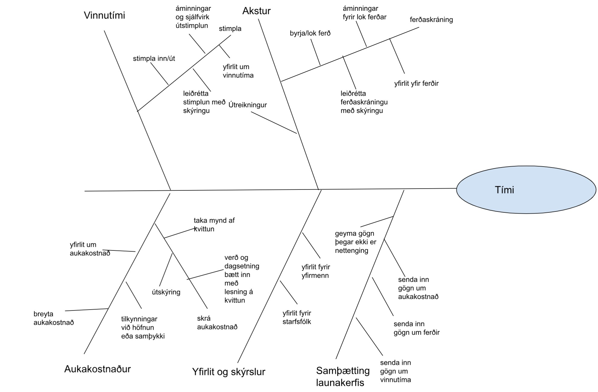

# Sýn og Afmörkun 

## Númer teymis og höfundar
[Hópur #4 Bergur, Helga, Kristófer]

## Heiti kerfis
[Tími]

## Efnisyfirlit 
- [Breytingasaga](#revision-history)
- [1. Viðskiptakröfur](#1-business-requirements)
    - [1.1 Bakgrunnur](#11-background)
    - [1.2 Viðskiptatækifæri](#12-business-opportunity)
    - [1.3 Viðskiptamarkmið](#13-business-objectives)
    - [1.4 Árangursmælikvarðar ](#14-success-metrics)
    - [1.5 Sýn](#15-vision-statement)
    - [1.6 Viðskiptaáhætta](#16-business-risks)
    - [1.7 Viðskiptaforsendur og háðleiki](#17-business-assumptions-and-dependencies)
- [2. Umfang og takmarkanir](#2-scope-and-limitations)
    - [2.1 Helstu fídusar](#21-major-features)
    - [2.2 Umfang fyrstu útgáfu](#22-scope-of-initial-and-subsequent-releases)
    - [2.3 Takmarkanir og útilokanir](#23-limitations-and-exclusions)
- [3. Samhengi viðskipta](#3-business-context)
    - [3.1 Prófílar hagsmunaaðila](#31-stakeholder-profiles)
    - [3.2 Forgangsröðun verkefnis](#32-project-priorities)
    - [3.3 Innleiðingarsjónarmið](#33-deployment-considerations)

---
> Hver kafli á að vera um það bil hálf síða að lengd.
> 
## 1. Viðskiptakröfur
### 1.1 Bakgrunnur

### 1.2 Viðskiptatækifæri

### 1.3 Viðskiptamarkmið

BO-1: Stytta tíma sem starfsmaður eyðir í skráningu um 25%, 6 mánuðum eftir fyrstu útgáfu.

- Scale: Meðaltími sem notandi eyðir í að skrá vinnu, akstur og kvittanir á dag.
- Meter: Mældur með notendagögnum úr kerfinu (inn- og útskráningartími skráninga) og notendakönnun.
- Past (Baseline): Um 8 mínútur á dag að meðaltali.
- Goal: 6 mínútur á dag.
- Stretch: 5 mínútur á dag.

BO-2: Nákvæmari útreikningur á eldsneytiskostnaði, gert er ráð fyrir að hægt sé að minnka eldneytiskostnað um 5% ári eftir fyrstu útgáfu.

- Scale: Meðalheildarkostnaður vegna aksturs (krónur á kílómetra) á ári.
- Meter: Upplýsingar úr kerfinu og reikningum bókhalds um endurgreiddan aksturskostnað.
- Past (Baseline): 100% af skráðum aksturskostnaði endurgreiddur án samanburðar við raunakstur.
- Goal: 95% af fyrri kostnaði (5% sparnaður).
- Stretch: 90% af fyrri kostnaði (10% sparnaður).

BO-3: Minnka villur í skráningu kostnaðar og launaútreikningi um 90%, 4 mánuðum eftir fyrstu útgáfu.

- Scale: Fjöldi villutilfella í kostnaðar- eða launaútreikningi á mánuði.
- Meter: Skráðar villur í bókhaldskerfi eða endurskoðunargögnum.
- Past (Baseline): 20 villur á mánuði.
- Goal: 2 villur á mánuði.
- Stretch: 0–1 villa á mánuði.

BO-4: Stytta þann tíma sem tekur að fá endurgreiðslu á aukakostnaði um 20%, 6 mánuðum eftir fyrstu útgáfu.

- Scale: Meðaltími (í dögum) frá innsendingu kvittunar til endurgreiðslu.
- Meter: Bókhaldskerfi sveitarfélagsins og dagsetningar úr kvittunarskrá.
- Past (Baseline): 10 dagar að meðaltali.
- Goal: 8 dagar að meðaltali.
- Stretch: 6 dagar að meðaltali.

BO-5: Stytta tíma þar til stjórnendur fá yfirlit yfir vinnutíma, akstur og endurgreiðslur um 10%, 6 mánuðum eftir fyrstu útgáfu.

- Scale: Meðaltími frá því að vika lýkur þar til stjórnandi fær fullbúið yfirlit.
- Meter: Kerfisloggar og innsendingardagsetningar skýrslna.
- Past (Baseline): 5 dagar eftir lok viku.
- Goal: 4,5 dagar.
- Stretch: 4 dagar.

BO-6: Sleppa tvískráningu á upplýsingum, starfsmaður launadeildar þarf ekki að slá inn upplýsingar, aðeins að yfirfara. 90%, 6 mánuðum eftir fyrstu útgáfu.

- Scale: Hlutfall færslna sem eru fluttar sjálfvirkt úr kerfinu í bókhald/launakerfi án handvirkrar innsláttar.
- Meter: Hlutfall sjálfvirkra gagnainnflutninga samkvæmt kerfisloggum og bókhaldsferlum.
- Past (Baseline): 0% sjálfvirkt (allt slegið inn handvirkt).
- Goal: 90% sjálfvirkt flutt.
- Stretch: 100% sjálfvirkt flutt.

### 1.4 Árangurs mælikvarðar

### 1.5 Framtíðarsýn

Tími er farsímaforrit fyrir starfsfólk liðveislu sem þurfa einfalda, örugga og áreiðanlega leið til þess að skrá vinnutíma, akstur og annan kostnað á fljótlegan hátt. Með Tíma getur notandinn skráð sig inn í kerfið þegar hann byrjar að vinna, og skráð sig út þegar vinnu líkur. Tíminn sem hann vinnur skráist sjálfkrafa í kerfið og sendir upplýsingar í miðlægt launakerfi þar sem laun starfsmannsins eru reiknuð. Kerfið getur einnig haldið um akstur á vinnutíma, ef notandinn skráir upphaf og lok aksturs. Upplýsingar um heildarakstur og eldsneytiskostnað eru einnig sendar í miðlægt launakerfi til vinnslu. Kerfið nýtir sér GPS við reikning á akstri. Einnig á notandinn að geta skráð aukakostnað vegna matar og afþreyingar til endurgreiðslu og geta tekið myndir af tengdum kvittunum.  Starfsfólk fær strax yfirsýn yfir unnar klukkustundir og uppsafnaðan akstur og stöðu á endurgreiðslu aukakostnaðar. Viðmótið er hannað fyrir notendur með mismunandi tæknikunnáttu og virkar án nettengingar. Nýja lausnin leysir af hólmi mjög handvirkt ferli. Í dag skráir starfsfólk ferðir, vinnutíma og aukakostnað í mismunandi kerfi eða í dagbók og skilar inn. Starfsmaður launadeildar slær þessar upplýsingar inn í kerfið til þess að reikna laun og endurgreiða kostnað. Kerfið mun gera ferlið mun skilvirkara og minnka villuhættu í innslætti.

### 1.6 Viðskiptaáhætta

### 1.7 Viðskiptaforsendur og háðleiki

---

## 2. Umfang  og takmarkanir 
### 2.1 Helstu fídusar

- FE-1: Stimpla sig inn/út úr vinnu.
- FE-2: Merkja byrjun og lok aksturs.
- FE-3: Sjálfvirk skráning aksturslengdar og hraða.
- FE-4: Útreikningur eldsneytiskostnaðar.
- FE-5: Skráning aukakostnaðar með mynd af kvittun.
- FE-6: Samþætting við launakerfi; allur vinnutími, akstur og aukakostnaður flyst sjálfvirkt í launakerfi.
- FE-7: Yfirlit yfir vinnutíma, akstur og aukakostnað fyrir starfsmenn og yfirmenn.
- FE-8: Yfirlit yfir stöðu aukakostnaðar.
- FE-9: Forritið virkar án nettengingar.

### 2.2 Umfang fyrstu útgáfu

| Feature | Release 1 | Release 2 | Release 3 |
|---|---|---|---|
| FE-1: Stimpla inn/út | Einföld stimplun inn/út í síma. Hægt að leiðrétta ef gleymist. | Áminning og sjálfvirk stimplun út í lok dags og stillanlegar vaktir. | Lausn fullgerð |
| FE-2: Akstur byrja/lok | Byrja/lok hnappur. Handvirk leiðrétting leyfð. | Áminning um að ljúka ferð. | Lausn fullgerð |
| FE-3: Sjálfvirk skráning aksturslengdar og hraða | Grunn útreikningur úr GPS. | Nákvæmari mæling. | Lausn fullgerð |
| FE-4: Útreikningur eldsneytiskostnaðar | Ekki þróað í útgáfu 1 | Reiknað út frá stöðlum. | Lausn fullgerð |
| FE-5: Skráning aukakostnaðar | Ekki þróað í útgáfu 1 | Skrifað er inn dags., verð og útskýring. Tekin er mynd af kvittun. | Útskýring slegin inn. Tekin er mynd af kvittun og dags. og verð fer sjálfkrafa inn. |
| FE-6: Samþætting við launakerfi | Stuðningur við mest notaða launakerfið. | Ekkert | Stuðningur við fleiri launakerfi. |
| FE-7: Yfirlit yfir vinnutíma, akstur og aukakostnað | Yfirlit yfir akstur og vinnutíma. | Ítarlegri skýrslugerð. | Lausn fullgerð |
| FE-8: Yfirlit yfir stöðu aukakostnaðar | Ekki þróað í útgáfu 1 | Sýnileg staða sent / samþykkt / hafnað | Tilkynningar |
| FE-9: Án nettengingar / samstilling | Ekki þróað í útgáfu 1 | Hægt að skrá án nets. Appið geymir gögn og sendir þau sjálfkrafa þegar síminn tengist Wi-Fi. | Lausn fullgerð |

### 2.3 Takmarkanir og útilokanir

---

## 3. Samhengi viðskipta
### 3.1 Prófílar forgangs hagsmunaaðila 

| **Stakeholder**                           | **Major Value**                                                                        | **Attitudes**                                                                                                              | **Major Interests**                                                                                     | **Constraints**                                                                                                 |
| ----------------------------------------- | -------------------------------------------------------------------------------------- | -------------------------------------------------------------------------------------------------------------------------- | ------------------------------------------------------------------------------------------------------- | --------------------------------------------------------------------------------------------------------------- |
| **Starfsfólk (endanotendur)**             | Auðveldari skráning á vinnu, akstri og kvittunum; tryggir rétt laun og endurgreiðslur. | Spenntir fyrir því að hafa einfalt kerfi sem sparar tíma og minnkar skrifræði; geta þó haft áhyggjur af tæknilegri flækju. | Notendavænt viðmót; áreiðanleg tímaskráning; sjálfvirkur launaútreikningur; möguleiki á notkun án nets. | Takmörkuð tæknikunnátta hjá sumum notendum; þarf að virka á bæði iOS og Android; þarf að virka án nettengingar. |
| **Yfirmenn / Umsjónarmenn liðveislu**     | Betri yfirsýn yfir starfsfólk, vinnutíma og kostnað; einfaldara samþykktarferli.       | Jákvæðir ef kerfið eykur skilvirkni og minnkar pappírsnotkun; vilja áreiðanleg gögn.                                       | Að geta samþykkt skráningar og kvittanir auðveldlega; yfirlit yfir heildarvinnutíma og kostnað.         | Þarf að hafa aðgang að rauntímagögnum og stöðluðu sniði fyrir skýrslur.                                         |
| **Bókhald / Fjármáladeild**               | Sparar tíma og tryggir nákvæmar greiðslur; rafræn gögn auðvelda vinnslu.               | Styðja innleiðingu ef gögn eru samhæfð við bókhaldskerfi; annars efins.                                                    | Samræmdar skýrslur; rétt útreiknað laun og kostnaður; einfaldur útflutningur í CSV/Excel.               | Þarf samhæfni við launakerfi sveitarfélagsins; þarf að uppfylla GDPR-reglur.                                    |
| **Sveitarfélag / Launagreiðandi stofnun** | Betri yfirsýn yfir launakostnað og endurgreiðslur; minni pappírsnotkun.                | Jákvætt við nýtt kerfi ef það eykur gagnsæi og sparar tíma.                                                                | Traust gagnasöfnun; öruggar samþættingar við launakerfi og bókhald.                                     | Krafist samræmis við lög og reglur um persónuvernd; þarf samþykki til gagnaflutnings.                           |
| **Kerfisstjóri / Tækniaðili**             | Stöðugt og öruggt kerfi sem er auðvelt í viðhaldi.                                     | Hlutlaus en leggur áherslu á öryggi, rekstrarstöðugleika og skjölun.                                                       | Öruggt gagnaflæði; einfalt að uppfæra og bæta kerfið.                                                   | Takmarkaður tími og fjármagn til viðhalds; þarf skjalfestar ferlar og öryggisafrit.                             |
| **Þróunarteymi**                          | Skýr verkefnaskil og jákvæð notendaupplifun; tækifæri til að þróa notendavænt kerfi.   | Áhugasamir og jákvæðir ef kröfur eru skýrar og samvinna við notendur góð.                                                  | Regluleg endurgjöf frá notendum; auðveld uppfærsla og prófanir.                                         | Tímarammi og fjárhagsáætlun geta takmarkað virkni í fyrstu útgáfu.                                              |

### 3.2 Forgangsröðun verkefnis 

### 3.3 Innleiðingarsjónarmið 

## Breytingasaga
<!--
Í stað þess að halda utan um alla commit-sögu er aðeins skráð formleg útgáfa (milestones) með Git tags (merkjum).  
Hver lína í töflunni samsvarar tag (merki) sem hefur verið sett í Git repositoryið.
> 🔖 Revision History er viðhaldið með **Git tags**.  
> Þegar ný útgáfa (t.d. drög eða baseline) er tilbúin, búið til tag í Git (`git tag -a vX.Y -m "message" && git push origin vX.Y`)  
> sem bætir einni línu við í töfluna hér að neðan.
-->
> 🔖 Taflan hér á eftir er búin til með því að keyra shell skrána `updatevisionhistory.sh` í bash terminal
> 
>  `chmod +x updatevisionhistory.sh`
> 
>  `./updatevisionhistory.sh`
> 
>  Ef þú vilt skoða töfluna fyrst til að sjá hvernig hún kemur út geturðu gert eftirfarandi beint úr skelinni 
> `git log -n 5 --pretty=format:"| %an | %ad | %s | %h |" --date=short -n 10 -- VISIONSCOPE.md`

<!-- GIT_HISTORY_START -->
| Author | Date       | Message | Commit |
|--------|------------|---------|--------|
| Ebba Þóra Hvannberg | 2025-09-08 | fyrsta útgáfa og Revision history gert sjálfvirkt | 5b39409 |

<!-- GIT_HISTORY_END -->

> Skoða allt: `git log -- "VISIONSCOPE.md" `
